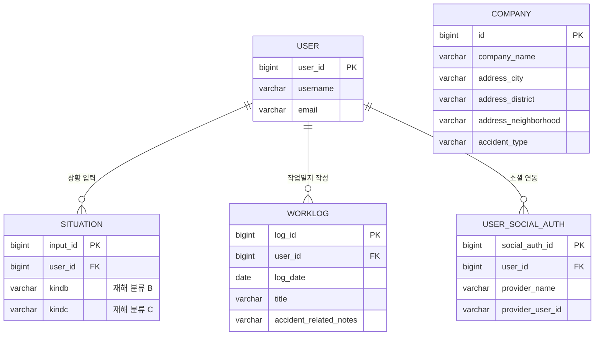
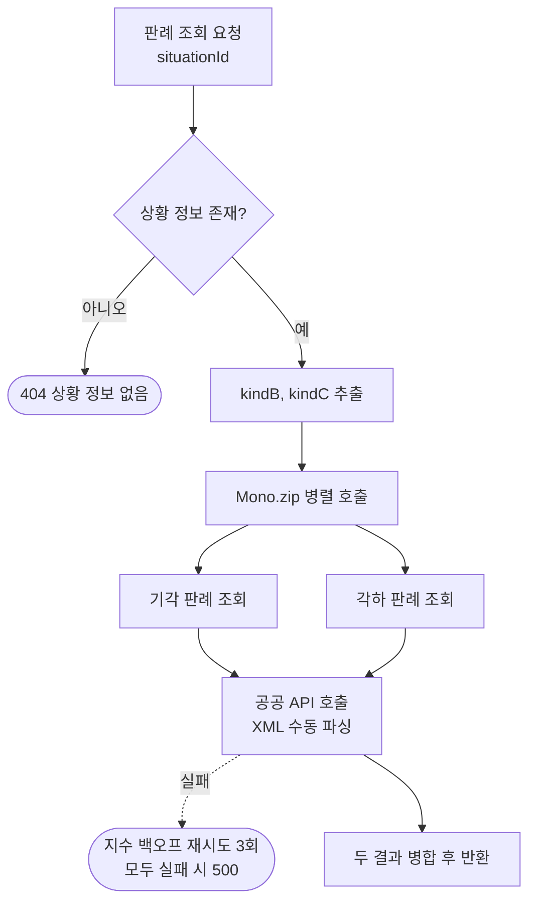
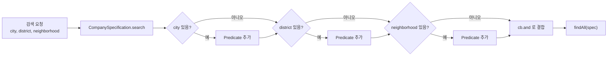
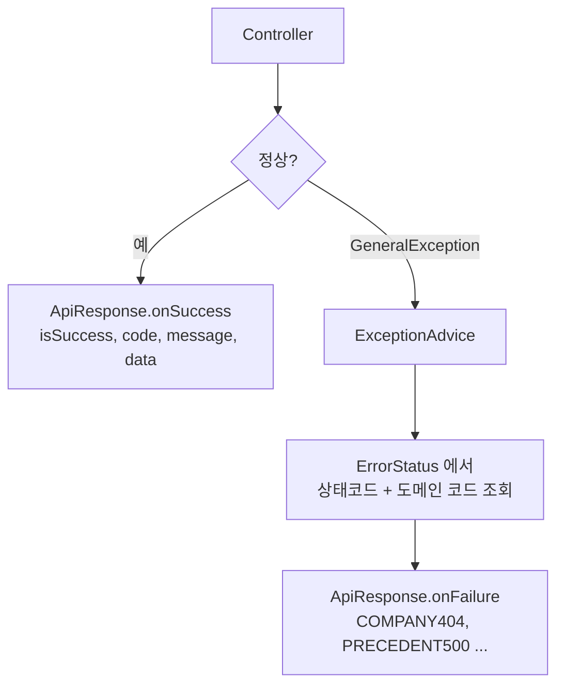
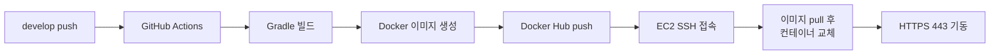

# N0tice

산업재해를 예방하려는 현장 근로자를 위한 안전 정보 서비스입니다.
내 사업장의 사고 이력을 찾아보고, 겪은 상황과 같은 유형의 산재 판례를 조회해 무엇이 문제가 됐는지 확인할 수 있습니다.


---

## 프로젝트 개요

**사고가 나기 전에, 이미 일어난 사고에서 배웁니다.**

산업재해 정보는 이미 공공데이터로 공개돼 있지만 흩어져 있습니다.
사업장 사고 이력은 통계 사이트에, 산재 판례는 법령 API에 따로 있어서 현장 근로자가 직접 찾아보기 어렵습니다.

그래서 두 가지를 한곳에 모았습니다.
지역이나 사업장명으로 사고 이력을 검색하고, 자신이 겪은 상황을 분류 코드로 입력하면
**같은 유형에서 실제로 패소한 판례**를 공공 API에서 실시간으로 가져와 보여 줍니다.
승소 사례보다 패소 사례가 "이렇게 하면 인정받지 못한다"를 더 분명하게 알려주기 때문입니다.

## 팀 구성 및 담당 역할

2025.05.19 ~ 08.08 (약 3개월) 동안 2명이 개발했습니다. 이슈에서 브랜치를 따고 PR로 합치는 흐름으로 협업했습니다.

|  |  |
|:---:|:---:|
| **구지민** | **장난영** |
| [@jimizip](https://github.com/jimizip) | [@warmzer0](https://github.com/warmzer0) |
| 판례 연동 / 공통 규약 / 배포 | 인증 / 회원 / 사고 / 작업일지 |

## 기술 스택

| 구분 | 기술 | 선택 이유 |
|---|---|---|
| Language | Java 21 | |
| Framework | Spring Boot 3.5.0, Spring Data JPA | |
| | Spring WebFlux (WebClient) | 판례를 기각/각하 두 건 병렬 호출하기 위해 리액티브 클라이언트 사용 |
| Database | PostgreSQL | |
| Cache | Redis | 리프레시 토큰 저장 (TTL 7일) |
| Auth | OAuth 2.0 (Naver), jjwt 0.12.2 | 현장 근로자 대상이라 가입 절차를 없애려고 소셜 로그인만 지원 |
| Parsing | jackson-dataformat-xml | 공공 API가 XML만 반환해 수동 파싱 경로가 필요 |
| Infra | Docker, GitHub Actions, AWS EC2 | `develop` push 시 이미지 빌드부터 컨테이너 교체까지 자동화 |
| Docs | springdoc-openapi 2.8.8 | |
| Etc | Lombok, java-dotenv | |

## 도메인 구조



판례는 **DB에 저장하지 않고** 요청 시점에 공공 API에서 조회합니다.
원본이 계속 갱신되는 데이터라 복제해두면 최신성이 깨지고, 저작권 문제도 피할 수 있습니다.
`SITUATION`은 사용자가 입력한 재해 분류 코드만 갖고 있고, 이것이 판례 조회의 검색 조건이 됩니다.

## 주요 기능

### 1. 상황 기반 판례 조회

같은 상황에서 어떤 판단이 내려졌는지 알아야 대비가 됩니다.
사용자가 재해 유형을 분류 코드로 입력하면, 그 조건으로 **패소 판례**를 공공 API에서 찾아옵니다.



- 패소 판례는 **기각과 각하** 두 종류로 나뉘어 API를 두 번 호출해야 합니다. 순차로 부르면 응답이 두 배로 느려져 `Mono.zip`으로 병렬 처리했습니다.
- 외부 API는 언제든 느려지거나 끊길 수 있어 `retryWhen` 지수 백오프로 일시적 실패를 흡수하고, 3회 모두 실패하면 `PRECEDENT500`으로 변환해 내려보냅니다.

### 2. 사업장 사고 이력 검색

사용자가 시/구/동을 어디까지 고를지 알 수 없습니다. 시만 고를 수도, 동까지 고를 수도 있습니다.
조건 조합마다 메서드를 만들면 8가지가 필요해, **JPA Specification으로 동적 조립**했습니다.



- 값이 있는 조건만 `Predicate` 리스트에 쌓고 마지막에 `cb.and`로 묶습니다. 조건이 하나도 없으면 전체 조회가 됩니다.
- 사업장명 검색은 조건이 하나뿐이라 Specification 없이 `findByCompanyNameContaining`으로 두었습니다. 단순한 곳에 굳이 복잡한 도구를 쓰지 않았습니다.

### 3. 공통 응답 / 예외 규약

둘이 각자 도메인을 나눠 맡다 보니 응답 형식이 제각각이 될 위험이 있었습니다.
성공과 실패를 하나의 껍데기로 통일하고, 예외는 전부 전역 핸들러로 모았습니다.



- 에러 코드를 `COMMON400` 같은 공통 코드와 `PRECEDENT404` 같은 도메인 코드로 나눴습니다. 프론트가 HTTP 상태만으로는 구분할 수 없는 실패 원인을 코드로 분기할 수 있습니다.
- `ErrorStatus`가 상태코드와 메시지를 한곳에서 관리하므로, 새 예외를 추가할 때 enum 한 줄만 늘리면 됩니다.

### 4. 소셜 로그인 및 배포

현장 근로자가 쓰는 서비스라 가입 절차를 없애려고 네이버 OAuth 2.0 로그인만 두었습니다.
JWT는 Redis에 저장해 서버가 세션 상태를 들고 있지 않아도 되게 했습니다.
배포는 `develop` 브랜치에 push하면 자동으로 진행됩니다.



- 모든 시크릿(DB 접속 정보, OAuth 키, JWT 키, 공공 API 키)은 GitHub Secrets에서 컨테이너 환경변수로 주입합니다. 이미지에는 값이 남지 않습니다.
- 배포 시 `docker system prune -af`로 이전 이미지를 정리해 EC2 디스크가 차는 것을 막았습니다.

## 트러블슈팅

| # | 문제 | 조치 | 결과 |
|:--:|---|---|---|
| 1 | 공공 API가 XML만 반환해 응답 매핑 실패 | 문자열로 받아 XmlMapper 수동 파싱 | 판례 조회 정상 동작 |
| 2 | 인증키 이중 인코딩으로 요청 거부 | 직접 인코딩 후 `build(true)` | API 인증 통과 |

### 1. 공공 API가 XML만 반환해 응답을 매핑할 수 없었다

#### 문제

판례 공공 API를 붙이는데 응답이 DTO로 들어오지 않았습니다.
`bodyToMono(PublicApiResponse.class)`로 받으면 디코딩 단계에서 실패했습니다.
JSON을 기대하고 만든 코드였는데 이 API는 **XML만 반환**했습니다.

#### 원인

WebClient는 응답 `Content-Type`을 보고 적절한 디코더를 고릅니다.
프로젝트에 XML 디코더가 등록돼 있지 않아 XML 본문을 객체로 바꿀 수단이 없었습니다.
`jackson-dataformat-xml`을 추가해도 WebClient의 코덱 설정에 자동으로 물리지는 않았습니다.

#### 해결

디코딩을 WebClient에 맡기지 않고, 응답을 **문자열로 먼저 받은 뒤 직접 파싱**하도록 바꿨습니다.
XML 구조에 맞춰 `PublicApiResponse` → `Body` → `Item` DTO를 정의하고 `XmlMapper`로 매핑합니다.

```java
return webClient.get().uri(uri)
        .accept(MediaType.APPLICATION_XML)
        .retrieve()
        .bodyToMono(String.class)          // 문자열로 먼저 받는다
        .map(xmlString -> {
            XmlMapper xmlMapper = new XmlMapper();
            PublicApiResponse response = xmlMapper.readValue(xmlString, PublicApiResponse.class);
            return (response != null && response.getBody() != null && response.getBody().getItems() != null)
                    ? response.getBody().getItems() : Collections.<Item>emptyList();
        });
```

응답이 비어 있거나 구조가 다를 때를 대비해 단계마다 null을 확인하고 빈 리스트로 떨어뜨렸습니다.
결과가 없는 것과 오류가 난 것을 구분하기 위해서입니다.

#### 결과

XML 응답이 정상적으로 `Item` 목록으로 매핑되어 판례 조회가 동작했습니다.

#### 남긴 것

응답이 비어 있는 것과 호출이 실패한 것은 다른 상황인데, 둘 다 빈 목록으로 떨어지면 구분할 수 없습니다.
`_EXTERNAL_API_ERROR`(PRECEDENT500)를 따로 정의해 두 경우가 같은 응답으로 보이지 않게 했습니다.

---

### 2. 인증키가 두 번 인코딩되어 요청이 거부됐다

#### 문제

XML 파싱을 해결하고 나니 이번엔 API가 인증 오류를 돌려줬습니다.
발급받은 인증키를 그대로 넣었는데 서버는 잘못된 키로 판단했습니다.

#### 원인

로그로 최종 요청 URL을 찍어 보고 원인을 찾았습니다.
공공데이터포털이 발급하는 인증키는 **이미 URL 인코딩된 문자열**입니다.
여기에 `UriComponentsBuilder`가 기본 동작으로 한 번 더 인코딩하면서
`%2B` 같은 문자가 `%252B`로 바뀌어 있었습니다. 서버가 받는 키는 원본과 다른 값이 됩니다.

#### 해결

인코딩 주체를 하나로 정리했습니다.
파라미터는 `URLEncoder`로 직접 인코딩하고, `build(true)`로 **이미 인코딩된 값임을 빌더에 알려** 추가 인코딩을 막았습니다.

```java
UriComponentsBuilder uriBuilder = UriComponentsBuilder.fromUriString(baseUrl)
        .queryParam("ServiceKey", URLEncoder.encode(serviceKey, StandardCharsets.UTF_8))
        .queryParam("numOfRows", 5)
        .queryParam("pageNo", 1);

uriBuilder.queryParam("kindA", URLEncoder.encode(kinda, StandardCharsets.UTF_8));
uriBuilder.queryParam("kindB", URLEncoder.encode(kindb, StandardCharsets.UTF_8));

URI uri = uriBuilder.build(true).toUri();   // true = 이미 인코딩됨, 다시 하지 않는다
log.info("Final API Request URL: {}", uri.toString());
```

#### 결과

인증이 통과되어 판례 목록을 받아왔습니다. 한글 검색 조건도 의도한 대로 전달됐습니다.

#### 남긴 것

인코딩이 어긋나면 오류가 아니라 **조용히 빈 결과**가 돌아오는 유형이라, 다음에 같은 문제가 생겨도 알아채기 어렵습니다.
최종 요청 URL을 `log.info`로 남겨 검색 조건이 바뀌었을 때 바로 확인할 수 있게 했습니다.

## API

Swagger UI(`/swagger-ui/index.html`)에서 스키마와 함께 확인할 수 있습니다.

<details>
<summary>엔드포인트 펼쳐보기</summary>

| Method | Path | 설명 |
|---|---|---|
| POST | `/api/situation-input` | 재해 상황 입력 (분류 코드 저장) |
| GET | `/api/accident-cases/match` | 상황에 맞는 판례 목록 조회 |
| GET | `/api/accident-cases/detail` | 사건번호로 판례 상세 조회 |
| GET | `/api/companies/search` | 사업장명 검색 |
| GET | `/api/companies/location` | 시 / 구 / 동 조합 검색 |
| POST / GET | `/api/work-logs` | 작업일지 작성 / 조회 |
| GET | `/api/work-logs/monthly` | 월별 작업일지 조회 |
| GET | `/api/users/me` | 내 정보 조회 |
| GET | `/api/users/{userId}` | 사용자 조회 |

</details>

---

<details>
<summary>실행 방법</summary>

배포 서버는 현재 내려간 상태이며, 아래는 로컬 실행 기준입니다.
저장소를 새로 받아 실행해 확인한 절차이며, **막히는 지점 세 가지를 함께 적었습니다.**

**요구 사항**: JDK 21, PostgreSQL, Redis, 공공데이터포털 인증키, OAuth 클라이언트

**먼저 알아야 할 것**

| 항목 | 상태 | 조치 |
|---|---|---|
| `.env.example` | 저장소에 없음 | 아래 표를 보고 `.env`를 직접 작성 |
| 환경변수 누락 | `NullPointerException`으로 기동 실패 | 15개를 **전부** 채워야 함 (`N0ticeBeApplication`이 `System.setProperty`에 null을 그대로 전달) |
| SSL 설정 | `key-store` 경로가 컨테이너 기준(`/app/keystore.p12`)으로 고정 | 로컬에서는 `server.ssl.enabled=false`, `server.port=8080`으로 덮어써야 함 |

```bash
git clone https://github.com/N0ticeteam/N0tice_Backend.git
cd N0tice_Backend
```

**1. 환경 변수** - 루트에 `.env`를 만들고 아래를 전부 채웁니다.

| 변수 | 용도 |
|---|---|
| `DB_URL`, `DB_USERNAME`, `DB_PASSWORD` | PostgreSQL 접속 |
| `REDIS_HOST`, `REDIS_PORT` | Redis 접속 (리프레시 토큰 저장) |
| `JWT_SECRET_KEY` | JWT 서명 키 |
| `JWT_ACCESS_TOKEN_EXPIRATION_TIME`, `JWT_REFRESH_TOKEN_EXPIRATION_TIME` | 토큰 만료 시간 (ms) |
| `JWT_REDIRECT` | 로그인 성공 후 리다이렉트 주소 |
| `OAUTH_NAVER_CLIENT_ID`, `OAUTH_NAVER_CLIENT_SECRET`, `OAUTH_NAVER_REDIRECT_URI` | 네이버 OAuth |
| `PUBLIC_API_SERVICE_KEY` | 공공데이터포털 인증키 |
| `SSL_KEYSTORE_TYPE`, `SSL_KEYSTORE_PASSWORD` | HTTPS 키스토어 |

`application.properties`에 구글 OAuth 설정이 남아 있지만 실제로 사용하지 않았습니다. 위 15개만 채우면 기동합니다.

**2. 실행** - PostgreSQL과 Redis를 먼저 띄운 뒤

```bash
./gradlew bootRun
```

</details>

<details>
<summary>협업 컨벤션</summary>

**커밋 타입**

| type | 설명 |
|---|---|
| `feat` | 새로운 기능 추가 |
| `fix` | 버그 수정 |
| `docs` | 문서 수정 |
| `style` | 코드 포맷팅, 세미콜론 누락 등 로직 변경 없음 |
| `refactor` | 코드 리팩터링 |
| `test` | 테스트 코드 추가 및 수정 |
| `chore` | 빌드 업무, 패키지 매니저 수정 |

**PR 아이콘**

| 아이콘 | 설명 |
|---|---|
| 🎨 | 코드의 구조 및 형태 개선 |
| ⚡️ | 성능 개선 |
| 🔥 | 코드 및 파일 삭제 |
| 🐛 | 버그 수정 |
| 🚑 | 긴급 수정 |
| ✨ | 새 기능 |
| ⏪ | 변경 내용 되돌리기 |
| 🔀 | 브랜치 병합 |
| 💡 | 주석 추가 및 수정 |
| 🗃 | 데이터베이스 관련 수정 |

</details>
